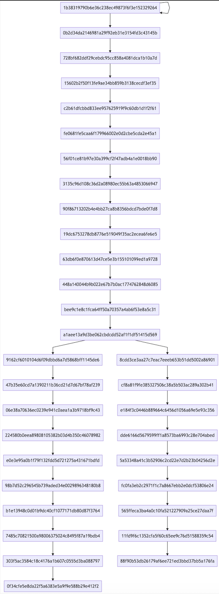
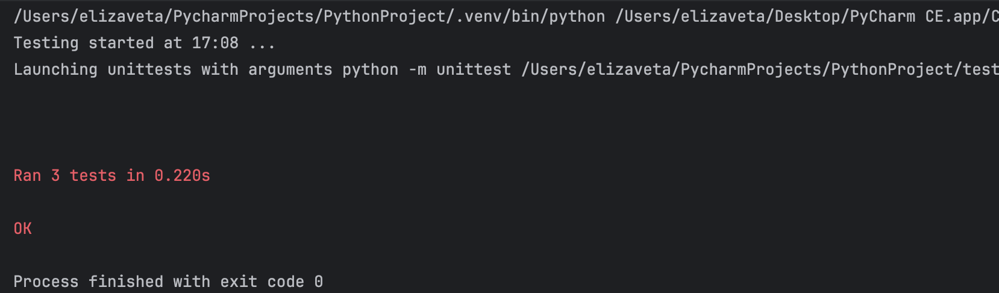

# **Задание №2**
Разработать инструмент командной строки для визуализации графа зависимостей, включая транзитивные зависимости. Сторонние средства для получения зависимостей использовать нельзя.

Зависимости определяются для **git-репозитория**. Для описания графа зависимостей используется представление **Mermaid**. Визуализатор должен выводить результат на экран в виде графического изображения графа.

Построить граф зависимостей для коммитов, в узлах которого содержатся хеш-значения.

Ключами командной строки задаются:
- Путь к программе для визуализации графов.
- Путь к анализируемому репозиторию.

Все функции визуализатора зависимостей должны быть покрыты тестами.
# Установка
Перед началом работы с программой требуется скачать репозиторий.

Клонирование репозитория:
```Bash
git clone https://github.com/Lizok256/konf2hw
```

# Запуск

Запуск [my_module.py](https://github.com/Lizok256/konf2hw/blob/main/my_module.py):
```Bash
python3 mu_module.py
```
Запуск [tests.py](https://github.com/Lizok256/konf2hw/blob/main/tests.py):
```Bash
pytest3 tests.py
```
# Тесты
## Зависимости [репозитория](https://github.com/Lizok256/konf1hw), взятого для теста:


## Общие тесты

